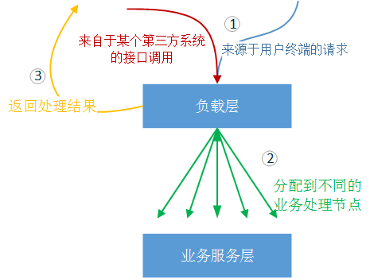
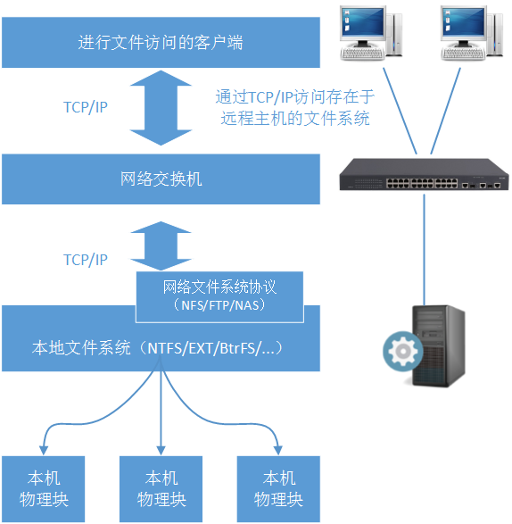

架构设计，参考：https://yinwj.blog.csdn.net/category_5585451.html

架构之美：https://zhuanlan.zhihu.com/p/54325617

1、架构体系分层图
---------

在上图中我们描述了Web系统架构中的组成部分。并且给出了每一层常用的技术组件/服务实现。需要注意以下几点：

*   系统架构是灵活的，根据需求的不同，不一定每一层的技术都需要使用。例如：一些简单的CRM系统可能在产品初期并不需要K-V作为缓存；一些系统访问量不大，并且可能只有一台业务服务器存在，所以不需要运用负载均衡层。
    
*   业务系统间通信层并没有加入传统的HTTP请求方式。这是因为HTTP请求-响应的延迟比较高，并且有很多次和正式请求无关的通信（这在下面的内容中会详细讲到）。所以，传统的HTTP请求方式并不适合在两个高负载系统之间使用，其更多的应用场景是各种客户端（WEB、IOS、Android等）->服务器端的请求调用。
    
*   我们把业务编码中常使用的缓存系统归入到数据存储层，是因为类似于Redis这样的K-V存储系统，从本质上讲是一种键值数据库。为什么Redis会很快以至于可以作为缓存使用，我将在随后的文章中进行详细的描述。
    
*   还有一点需要注意的是，上面架构图中的每层之间实际上不存在绝对的联系（例如负载层一定会把请求转送的业务层，这样的必然性是不存在的），在通常情况下各层是可以跨越访问的。举例说明：如果HTTP访问的是一张图片资源，负载层不会把请求送到业务层，而是直接到部署的分布式文件系统上寻找图片资源并返回。再比如运用LVS做Mysql负载时，负载层是直接和数据存储层进行合作。
    

2、负载分配层
-------

实际上负载均衡的概念很广泛，所述的过程是将来源于外部的处理压力通过某种规律/手段分摊到内部各个处理节点上。在日常生活中我们随时随地在和负载技术打交道，例如：上下班高峰期的车流量引导、民航空管局的航空流量管制、银行柜台的叫号系统。

这里我们所说的负载分配层，是单指利用软件实现的计算机系统上的狭义负载均衡。一个大型（日PV一亿+）、中型（日PV一千万+）Web业务系统，是不可能只有一个业务处理服务，而是多台服务器同时进行某一个相同业务的服务。所以我们需要根据业务形态设计一种架构方式，将来自外部客户端的业务请求分担到每一个可用的业务节点上。如下图所示：

负载层还有一个作用，是根据用户的请求规则，将不同的请求类型分派到不同的服务器上。例如：如果某一个HTTP请求是请求一张图片，那么负载层会直接到图片存储介质上寻找相应的图片；如果某一个HTTP请求是提交的一张订单，那么负载层会根据规则将这张订单提交发送到指定的“订单服务”节点上。

不同的业务需求，使用的负载层方案也是不同的，这就考验架构师的方案选择能力。例如Nginx只能处理TCP/IP协议的之上应用层HTTP协议，如果要处理TCP/IP协议，则要按照第三方的TCP-Proxy-Module模。更好的直接在TCP/IP层负载的方案，是使用HAProxy。

常用的负载层架构方式包括：  
\- 独立的Nginx负载或HAProxy方案  
\- LVS（DR）+ Nginx方案  
\- DNS轮询 + LVS + Nginx方案  
\- 智能DNS（DNS路由） + LVS + Nginx方案

随后的文章中将详细介绍这些负载架构方案以及这些方案的变形。

3、业务服务层和通信层
-----------

### 3.1、概述

通俗来讲就是我们的核心业务层，订单业务、施工管理业务、诊疗业务、付款业务、日志业务等等。如下图所示：

很明显在中大型系统中，这些业务不可能是独立存在的，一般的设计要求都会涉及到子系统间脱耦：即X1系统除了知晓底层支撑系统的存在外（例如用户权限系统），X1系统不需要知道和它逻辑对等的X2系统的存在就可以工作。这种情况下要完成一个较复杂业务，子系统间调用又是必不可少的：例如A业务在处理成功后，会调用B业务进行执行；A业务在处理失败后，会调用C业务进行执行；又或者A业务和D业务在某种情况下是不可分割的整体，只有同时成功才成功，其中有一个失败整个大的业务过程都失败。如下图所示：

这样一来业务间的通信层又是一个逃不开的话题。 在随后的文章中，我们将以Alibaba的Dubbo框架、基于AMQP协议的消息队列和Kafka消息队列技术的原理和使用方式，来讲解业务通信层技术，特别是业务通信层的技术选型注意事项。

### 3.2、不得不提的HTTP请求方式

有的读者可能会问，为什么业务系统间通信层没有提到HTTP这样的调用方式。毕竟很多公司目前都采用这种方式作为业务系统间的调用方式。我们首先通过一个图来看看HTTP方式的调用过程。（注意，此过程不考虑http客户端缓存的过程也不考虑DNS域名解析的过程，从HTTP建立可靠的TCP连接开始）：

从上图中我们可以看出以下几个问题：

*   从技术原理层面看，HTTP请求是在需要进行调用时建立TCP连接，并且发送并等待数据回送，在得到请求结果后，可能需要再关闭这个TCP连接。这样的原理使得很多时间浪费在和业务无关的技术特性上。
*   另外，发送Head信息和接收Head这样的数据，对业务数据来说是毫无意义的。在访问量较小的情况下，这样的过程都还是可以接收的，但是当带宽资源吃紧的情况下，这样的数据空间就是弥足珍贵的。
*   独立的HTTP请求由于没有SOA结构中的“治理中心”的概念，所以单纯的HTTP请求很难保证负责业务联动中的上下文一致性。当然你可以自行编码来保证，但那样真的合理吗？
*   最后，需要说明的是，现在类似Apache HTTP Components这样的组件提供了HTTP Pool来减少TCP连接时长，但这仅仅是优化了HTTP作为业务间通信时的一个问题，其他的问题依然存在。

> 基于以上的描述，本文并不推荐使用HTTP作为业务间通信/调用的方式，而建议HTTP方式仅限于WEB、iOS、Android等这样的客户端请求服务的方式。

4、数据存储层
-------

数据存储将是这个系列文章中将要介绍的另一个重点。进行业务计算前的初始数据、计算过程中的临时数据、计算完成后得到的计算结果都需要进行存储。我们通过一张思维导图首先从几个维度阐述一下数据存储的基本分类。

4.1、文件存储原理
----------

我们通过一个最基本的在Centos6.5系统上创建Ext4文件系统的过程，讲解文件系统的最基本原理。

*   首先我们会通过fdisk命令对本地硬盘进行分区（即确定可控制的扇区的范围），如下图所示：

*   然后我们会在这个区上面通过mkfs命令创建我们想要的文件系统（Ext3、Ext4、LVM、XF、BTRFS等），如下图所示：

*   最后我们挂载这个文件系统到指定的路径，如下图所示：

*   通过df命令查看挂载信息，如下图所示：  
    
    
*   万变不离其宗的创建过程告诉我们一个什么事实呢？
    

*   物理块，一个物理块是我们上层文件系统能够操作的最小单位（通常为512字节），一个物理块在底层对应了多个物理扇区。通常一块SATA硬盘会有若干机械手臂（决定于物理盘片数量），和若干个物理扇区（物理扇区的大小是磁盘出厂时就确定的，我们无法改变）。
    
*   单个扇区的工作是单向的，那么映射出来的一个物理块的工作方式也是单向的。原理就是机械手臂在读取这个扇区的数据时，硬件芯片是不允许机械手臂同时向这个扇区写入数据的。
    
*   通过上层文件系统（EXT、NTFS、BTRFS、XF）对下层物理块的封装，OS是不需要直接操作磁盘物理块的，操作者通过ls这样的命令看到的一个一个文件也不需要关心这些文件在物理块的存储格式。这就是为什么不同的文件系统有不同的特性（有的文件系统支持快照，有的文件系统支持数据恢复），基本原理就是这些文件系统对下层物理块的操作规范不一样。
    

4.2、块存储和文件存储
------------

上一小节我们叙述了最简单、最原始的物理块和文件格式规范的工作方式，但是随着服务器端不断扩大的数据存储容量的需求和数据安全性的需求，很显然单机的存储是没办法满足要求的，目前存储环境两种大的需求类型是：

*   稳定的扩展存储容量，并且不破坏目前已存储的数据信息，不影响整个存储系统的稳定性。
    
*   文件共享，让多台服务器能够共享存储数据，并且都可以对文件系统进行读写操作。
    

要解决这两个问题，我们首先要将问题扩展到上一小节的图例中，如下图所示：

很明显图中两个问题的答案是肯定的，也就是我们将要介绍的块存储系统要解决的问题。

### 4.2.1、块存储系统

我们先来聊一下块存储。之前我们提到的最简单的情况就是磁盘在本地物理机上，传输的物理块I/O命令，也是通过本地物理机主板上的南桥进行的。但是为了扩展更大的磁盘空间，并且保证数据吞吐量，我们需要将磁盘介质和本地物理机分离，并且让物理块的I/O命令在网络上进行传输：

*   虽然磁盘介质和本地物理机发生了分离，但是直接传输块I/O命令的本质是没有改变的。本地南桥传输I/O命令变成了光纤传输，只在本物理机内部传输I/O命令变成了网络传输，并且I/O命令通过某种通信协议进行了规范（例如FC、SCSI等）。
    
*   文件系统的映射却是在本地进行，而非远程的文件系统映射。上文中我们已经提到，由于块操作的顺序性（在一个扇区进行写入的时候，是不会进行这个扇区的读取操作的），且块操作属于底层物理操作无法向上层的文件逻辑层主动反馈变化。所以多个物理主机是无法通过这个技术进行文件共享的。
    
*   块存储系统要解决的是大物理存储空间、高数据吞吐量、强稳定性的共存问题。作为上层使用这个文件系统的服务器来说，它非常清楚，除了它以外没有其他的服务器能够对专属于它的这些物理块进行读写操作了。也就是说它认为这个庞大容量的文件存储空间只是它本地物理机上的存储空间。
    
*   当然随着技术的发展，现在已经有一些技术可以只用TCP/IP协议对标准的SCSI命令进行传输，以便减小这个块存储系统的建设成本（例如iSCSI技术）。但是这种折中方式也是以减弱整个系统的数据吞吐量为代价的。不同的业务需求可以根据实际情况进行技术选型。
    

### 4.2.2、文件存储系统

那么如果是将文件系统从本地物理机通过网络移植到远程呢？当然可以，典型的文件存储系统包括了FTP、NFS、DAS：  

*   文件存储系统的关键在于，文件系统并不在本机。而是通过网络访问存在于远程的文件系统，再由远程的文件系统操作块I/O命令完成数据操作。
    
*   一般来说诸如本地文件系统NTFS/EXT/LVM/XF等是不允许直接网络访问的，所以一般文件存储系统会进行一层网络协议封装，这就是NFS协议/FTP协议/NAS协议（注意我们说的是协议），再由协议操作文件存储系统的服务器文件系统。
    
*   文件存储系统要解决的问题首要的文件共享，网络文件协议可以保证多台客户端共享服务器上的文件结构。从整个架构图上可以看到文件存储系统的数据读写速度、数据吞吐量是没办法和块存储系统相比的（因为这不是文件存储系统要解决的首要问题）。
    

> 从上面的简介中我们可以清楚的知晓，当面对大量的数据读写压力的时候，文件存储系统肯定不是我们的首要选择，而当我们需要选择块存储系统时又面临成本和运维的双重压力（SAN系统的搭建是比较复杂的，并且设备费用昂贵）。并且在实际生产环境中我们经常遇到数据读取压力大，且需要共享文件信息的场景。那么这个问题怎么解决呢？

4.3、对象存储系统
----------

兼具块存储系统的高吞吐量、高稳定性和文件存储的网络共享性、廉价性的对象存储就是为了满足这样的需求出现的。典型的对象存储系统包括：MFS、Swift、Ceph、Ozone等。下面我们简单介绍一下对象存储系统的特点，在后面的文章中，我们将选择一款对象存储系统进行详细说明。

> 对象存储系统一定是分布式文件系统。但分布式文件系统不一定是对象存储系统

*   我们知道文件信息是由若干属性进行描述的，包括文件名、存储位置、文件大小、当前状态、副本数量等信息。我们将这些属性抽离出来，专门使用服务器进行存储（元数据服务器）。这样一来文件操作的客户端要访问某一个文件，首先会询问元数据节点这个文件的基本信息。
    
*   由于是分布式系统，那么数据一致性、资源争夺、节点异常问题都需要进行统一的协调。所以对象存储系统中一般会有监控/协调节点。不同的对象存储系统，支持的元数据节点和监控/协调节点的数量是不一致的。但总的趋势都是“去中心化”。
    
*   OSD节点（基于对象的存储设备）用于存储文件内容信息。这里要注意，虽然OSD节点的底层和块存储底层一样都是依靠块I/O进行操作的，但是上层构造两者完全不同：OSD节点并非向块存储设备那样，通过块操作命令跳过本地文件系统直接进行物理块操作。
    
*   随后的文章中我们将选择一款流行的对象存储系统，详细剖析对象存储系统，并且对分布式存储系统中三个核心概念和取舍进行说明（CAP）：一致性、扩展性和容错性。
    

### 4.3、数据库存储

这篇文章已经写了很多存储层的概要描述了，所以我们熟悉或者不熟悉的数据库存储技术的概述就不在这里介绍了。

后续的文章我将使用Mysql讲解几个常用的架构方案和性能优化点，当然也会讲到Mysql中，诸如Innodb这样的核心数据引擎的工作方式。这些架构方案主要解决的是Mysql的单机I/O瓶颈、机房内数据容灾、数据库稳定性、跨机房数据容灾等核心问题。

后续的文章我还会选取目前流行的数据缓存系统，讲解其工作原理、核心算法和架构方案。以便读者们根据自己的业务情况设计符合业务的存储集群。当然还有非关系型数据库Cassandra、HBase、MongoDB的深入介绍。

5、评价架构的特性
---------

我们如何来评价一个服务系统的顶层设计是否优秀呢？抛开八股文式的扩展性、稳定性、健壮性、安全性这样的套话不说。我从实际工作中为大家总结了一下几个评价要点。

### 5.1、建设成本

任何系统架构在进行生产环境实施的时候，都是需要付出建设成本的。显然各个公司/组织对成本的承受度是不一样的（这些成本包括：设计成本、资产采购成本、运维成本、第三方服务成本），所以如何利用有限的成本建设出符合业务需求、适应访问规模的系统，就是一个复杂的问题。另外，这种要求下架构师是不能进行过度设计的。

### 5.2、扩展/规划水平

根据业务的发展，整个系统是需要进行升级的（这包括已有模块的功能升级、合并已有的模块、加入新的业务模块或者在模块功能不变的情况下提高数据吞吐量）。那么如何尽量不影响原业务的工作，以最快的速度、最小的工作量来进行系统的横向、纵向扩展，也就是一个复杂的问题了。好的系统架构是可以在用户无任何感觉的情况下进行升级的，或者只需要在某些关键子系统升级时才需要短暂的停止服务。

### 5.3、抗攻击水平

对系统的攻击肯定是瞄准整个系统最薄弱的环节进行的，攻击可能来自于外部（例如Dos/DDos攻击）也可能来自于内部（口令入侵）。好架构的系统不是“绝对不能攻破”的系统，而是“预防很好”的系统。所谓预防，就是预防可能的攻击，分阶段对可能遇到的各种攻击进行模拟；所谓隐藏，就是利用各种手段对整个系统的关键信息进行涉密管理，ROOT权限、物理位置、防火墙参数、用户身份。

### 5.3、容灾恢复等级

好的架构应该考虑不同等级的容灾。集群容灾，在集群中某一个服务节点崩溃的情况下，集群中另外一台主机能够接替马上接替他的工作，并且故障节点能够脱离；分布式容灾：分布式系统一般会假设整个系统中随时都在发生单点故障/多点故障，当产生单点故障/多点故障时，整个分布式系统都还可以正常对外提供服务，并且分布式系统中的单点故障/多点故障区可以通过自动/人工的方式进行恢复，分布式系统会重新接纳它们；异地容灾（机房等级容灾）：在机房产生物理灾难的情况下（物理网络断裂、战争摧毁、地震等），在某个相隔较远的异地，备份系统能够发现这样的灾难发生，并主动接过系统运行权，通知系统运维人员（根据系统不同的运行要求，可能还有多个备份系统）。异地容灾最大的挑战性是如何保证异地数据的完整性。

### 5.4、业务适应性水平

系统架构归根结底还是为业务服务的，系统架构的设计选型一定是以服务当前的业务为前提。在上文中提到的业务通信层中，选择SOA组件还是消息队列组件，又或者选择什么样的消息队列，就是一个很好的业务驱动事件。例如，A业务是一种WEB前端服务，需要及时反馈给客户操作结果，B业务的服务压力又非常大。A业务在调用B业务时，B业务无法在毫秒级的时间内返回给A业务调用结果。这种业务场景下可以使用AMQP类型的消息队列服务。另外说明两点，目前行业内有很多为解决相同业务场景存在的不同方案，架构师在进行方案选型的过程中，一定要对各种解决方案的特点足够掌握，这样才能做出正确的选择；另外行业内的解决方案已经足够多，架构师在业务没有特殊要求的情况下一定不要做“ 重复发明轮子”的事情。

### 5.5、维护难易程度

一套服务系统从架设之初就需要运维团队不断的进行投入。显然根据系统的复杂程度和物理机器的数量，运维团队的知识复杂性也是不一样的。在架构师进行顶层架构设计时，必须还要考虑系统的运维难度和运维成本。

6、其他说明
------

*   负载层、业务层、业务通信层、数据存储层的详细架构方案在后续文章中我们会用若干文章进行深入讲解，包括核心算法、架设原理、架设案例。随后的文章中我们将首先介绍系统负载层。
    
*   在很多系统中我们还涉及存储的数据进行分析，形成数据分析结果。这涉及到数据分析层的架构知识。Hadoop生态系统是目前行业公认的高效率、高稳定性、高扩展性的数据分析生态系统。这个系列的博文暂时不会介绍数据分析层的架构设计和开发知识，后续将会独立成文。
    
* 各位看官我们马上进入负载层技术的详细讲解！1、架构体系分层图

  

  在上图中我们描述了Web系统架构中的组成部分。并且给出了每一层常用的技术组件/服务实现。需要注意以下几点：

  *   系统架构是灵活的，根据需求的不同，不一定每一层的技术都需要使用。例如：一些简单的CRM系统可能在产品初期并不需要K-V作为缓存；一些系统访问量不大，并且可能只有一台业务服务器存在，所以不需要运用负载均衡层。
      
  *   业务系统间通信层并没有加入传统的HTTP请求方式。这是因为HTTP请求-响应的延迟比较高，并且有很多次和正式请求无关的通信（这在下面的内容中会详细讲到）。所以，传统的HTTP请求方式并不适合在两个高负载系统之间使用，其更多的应用场景是各种客户端（WEB、IOS、Android等）->服务器端的请求调用。
      
  *   我们把业务编码中常使用的缓存系统归入到数据存储层，是因为类似于Redis这样的K-V存储系统，从本质上讲是一种键值数据库。为什么Redis会很快以至于可以作为缓存使用，我将在随后的文章中进行详细的描述。
      
  *   还有一点需要注意的是，上面架构图中的每层之间实际上不存在绝对的联系（例如负载层一定会把请求转送的业务层，这样的必然性是不存在的），在通常情况下各层是可以跨越访问的。举例说明：如果HTTP访问的是一张图片资源，负载层不会把请求送到业务层，而是直接到部署的分布式文件系统上寻找图片资源并返回。再比如运用LVS做Mysql负载时，负载层是直接和数据存储层进行合作。
      

  2、负载分配层
  -------

  实际上负载均衡的概念很广泛，所述的过程是将来源于外部的处理压力通过某种规律/手段分摊到内部各个处理节点上。在日常生活中我们随时随地在和负载技术打交道，例如：上下班高峰期的车流量引导、民航空管局的航空流量管制、银行柜台的叫号系统。

  这里我们所说的负载分配层，是单指利用软件实现的计算机系统上的狭义负载均衡。一个大型（日PV一亿+）、中型（日PV一千万+）Web业务系统，是不可能只有一个业务处理服务，而是多台服务器同时进行某一个相同业务的服务。所以我们需要根据业务形态设计一种架构方式，将来自外部客户端的业务请求分担到每一个可用的业务节点上。如下图所示：

  

  负载层还有一个作用，是根据用户的请求规则，将不同的请求类型分派到不同的服务器上。例如：如果某一个HTTP请求是请求一张图片，那么负载层会直接到图片存储介质上寻找相应的图片；如果某一个HTTP请求是提交的一张订单，那么负载层会根据规则将这张订单提交发送到指定的“订单服务”节点上。

  不同的业务需求，使用的负载层方案也是不同的，这就考验架构师的方案选择能力。例如Nginx只能处理TCP/IP协议的之上应用层HTTP协议，如果要处理TCP/IP协议，则要按照第三方的TCP-Proxy-Module模。更好的直接在TCP/IP层负载的方案，是使用HAProxy。

  常用的负载层架构方式包括：  
  \- 独立的Nginx负载或HAProxy方案  
  \- LVS（DR）+ Nginx方案  
  \- DNS轮询 + LVS + Nginx方案  
  \- 智能DNS（DNS路由） + LVS + Nginx方案

  随后的文章中将详细介绍这些负载架构方案以及这些方案的变形。

  3、业务服务层和通信层
  -----------

  ### 3.1、概述

  通俗来讲就是我们的核心业务层，订单业务、施工管理业务、诊疗业务、付款业务、日志业务等等。如下图所示：

  

  很明显在中大型系统中，这些业务不可能是独立存在的，一般的设计要求都会涉及到子系统间脱耦：即X1系统除了知晓底层支撑系统的存在外（例如用户权限系统），X1系统不需要知道和它逻辑对等的X2系统的存在就可以工作。这种情况下要完成一个较复杂业务，子系统间调用又是必不可少的：例如A业务在处理成功后，会调用B业务进行执行；A业务在处理失败后，会调用C业务进行执行；又或者A业务和D业务在某种情况下是不可分割的整体，只有同时成功才成功，其中有一个失败整个大的业务过程都失败。如下图所示：

  

  这样一来业务间的通信层又是一个逃不开的话题。 在随后的文章中，我们将以Alibaba的Dubbo框架、基于AMQP协议的消息队列和Kafka消息队列技术的原理和使用方式，来讲解业务通信层技术，特别是业务通信层的技术选型注意事项。

  

  ### 3.2、不得不提的HTTP请求方式

  有的读者可能会问，为什么业务系统间通信层没有提到HTTP这样的调用方式。毕竟很多公司目前都采用这种方式作为业务系统间的调用方式。我们首先通过一个图来看看HTTP方式的调用过程。（注意，此过程不考虑http客户端缓存的过程也不考虑DNS域名解析的过程，从HTTP建立可靠的TCP连接开始）：

  

  从上图中我们可以看出以下几个问题：

  *   从技术原理层面看，HTTP请求是在需要进行调用时建立TCP连接，并且发送并等待数据回送，在得到请求结果后，可能需要再关闭这个TCP连接。这样的原理使得很多时间浪费在和业务无关的技术特性上。
  *   另外，发送Head信息和接收Head这样的数据，对业务数据来说是毫无意义的。在访问量较小的情况下，这样的过程都还是可以接收的，但是当带宽资源吃紧的情况下，这样的数据空间就是弥足珍贵的。
  *   独立的HTTP请求由于没有SOA结构中的“治理中心”的概念，所以单纯的HTTP请求很难保证负责业务联动中的上下文一致性。当然你可以自行编码来保证，但那样真的合理吗？
  *   最后，需要说明的是，现在类似Apache HTTP Components这样的组件提供了HTTP Pool来减少TCP连接时长，但这仅仅是优化了HTTP作为业务间通信时的一个问题，其他的问题依然存在。

  > 基于以上的描述，本文并不推荐使用HTTP作为业务间通信/调用的方式，而建议HTTP方式仅限于WEB、iOS、Android等这样的客户端请求服务的方式。

  4、数据存储层
  -------

  数据存储将是这个系列文章中将要介绍的另一个重点。进行业务计算前的初始数据、计算过程中的临时数据、计算完成后得到的计算结果都需要进行存储。我们通过一张思维导图首先从几个维度阐述一下数据存储的基本分类。

  

  4.1、文件存储原理
  ----------

  我们通过一个最基本的在Centos6.5系统上创建Ext4文件系统的过程，讲解文件系统的最基本原理。

  *   首先我们会通过fdisk命令对本地硬盘进行分区（即确定可控制的扇区的范围），如下图所示：

  

  *   然后我们会在这个区上面通过mkfs命令创建我们想要的文件系统（Ext3、Ext4、LVM、XF、BTRFS等），如下图所示：

  

  *   最后我们挂载这个文件系统到指定的路径，如下图所示：

  

  *   通过df命令查看挂载信息，如下图所示：  
      
      
  *   万变不离其宗的创建过程告诉我们一个什么事实呢？
      

  

  *   物理块，一个物理块是我们上层文件系统能够操作的最小单位（通常为512字节），一个物理块在底层对应了多个物理扇区。通常一块SATA硬盘会有若干机械手臂（决定于物理盘片数量），和若干个物理扇区（物理扇区的大小是磁盘出厂时就确定的，我们无法改变）。
      
  *   单个扇区的工作是单向的，那么映射出来的一个物理块的工作方式也是单向的。原理就是机械手臂在读取这个扇区的数据时，硬件芯片是不允许机械手臂同时向这个扇区写入数据的。
      
  *   通过上层文件系统（EXT、NTFS、BTRFS、XF）对下层物理块的封装，OS是不需要直接操作磁盘物理块的，操作者通过ls这样的命令看到的一个一个文件也不需要关心这些文件在物理块的存储格式。这就是为什么不同的文件系统有不同的特性（有的文件系统支持快照，有的文件系统支持数据恢复），基本原理就是这些文件系统对下层物理块的操作规范不一样。
      

  4.2、块存储和文件存储
  ------------

  上一小节我们叙述了最简单、最原始的物理块和文件格式规范的工作方式，但是随着服务器端不断扩大的数据存储容量的需求和数据安全性的需求，很显然单机的存储是没办法满足要求的，目前存储环境两种大的需求类型是：

  *   稳定的扩展存储容量，并且不破坏目前已存储的数据信息，不影响整个存储系统的稳定性。
      
  *   文件共享，让多台服务器能够共享存储数据，并且都可以对文件系统进行读写操作。
      

  要解决这两个问题，我们首先要将问题扩展到上一小节的图例中，如下图所示：

  

  很明显图中两个问题的答案是肯定的，也就是我们将要介绍的块存储系统要解决的问题。

  ### 4.2.1、块存储系统

  我们先来聊一下块存储。之前我们提到的最简单的情况就是磁盘在本地物理机上，传输的物理块I/O命令，也是通过本地物理机主板上的南桥进行的。但是为了扩展更大的磁盘空间，并且保证数据吞吐量，我们需要将磁盘介质和本地物理机分离，并且让物理块的I/O命令在网络上进行传输：

  

  *   虽然磁盘介质和本地物理机发生了分离，但是直接传输块I/O命令的本质是没有改变的。本地南桥传输I/O命令变成了光纤传输，只在本物理机内部传输I/O命令变成了网络传输，并且I/O命令通过某种通信协议进行了规范（例如FC、SCSI等）。
      
  *   文件系统的映射却是在本地进行，而非远程的文件系统映射。上文中我们已经提到，由于块操作的顺序性（在一个扇区进行写入的时候，是不会进行这个扇区的读取操作的），且块操作属于底层物理操作无法向上层的文件逻辑层主动反馈变化。所以多个物理主机是无法通过这个技术进行文件共享的。
      
  *   块存储系统要解决的是大物理存储空间、高数据吞吐量、强稳定性的共存问题。作为上层使用这个文件系统的服务器来说，它非常清楚，除了它以外没有其他的服务器能够对专属于它的这些物理块进行读写操作了。也就是说它认为这个庞大容量的文件存储空间只是它本地物理机上的存储空间。
      
  *   当然随着技术的发展，现在已经有一些技术可以只用TCP/IP协议对标准的SCSI命令进行传输，以便减小这个块存储系统的建设成本（例如iSCSI技术）。但是这种折中方式也是以减弱整个系统的数据吞吐量为代价的。不同的业务需求可以根据实际情况进行技术选型。
      

  ### 4.2.2、文件存储系统

  那么如果是将文件系统从本地物理机通过网络移植到远程呢？当然可以，典型的文件存储系统包括了FTP、NFS、DAS：  
  

  *   文件存储系统的关键在于，文件系统并不在本机。而是通过网络访问存在于远程的文件系统，再由远程的文件系统操作块I/O命令完成数据操作。
      
  *   一般来说诸如本地文件系统NTFS/EXT/LVM/XF等是不允许直接网络访问的，所以一般文件存储系统会进行一层网络协议封装，这就是NFS协议/FTP协议/NAS协议（注意我们说的是协议），再由协议操作文件存储系统的服务器文件系统。
      
  *   文件存储系统要解决的问题首要的文件共享，网络文件协议可以保证多台客户端共享服务器上的文件结构。从整个架构图上可以看到文件存储系统的数据读写速度、数据吞吐量是没办法和块存储系统相比的（因为这不是文件存储系统要解决的首要问题）。
      

  > 从上面的简介中我们可以清楚的知晓，当面对大量的数据读写压力的时候，文件存储系统肯定不是我们的首要选择，而当我们需要选择块存储系统时又面临成本和运维的双重压力（SAN系统的搭建是比较复杂的，并且设备费用昂贵）。并且在实际生产环境中我们经常遇到数据读取压力大，且需要共享文件信息的场景。那么这个问题怎么解决呢？

  4.3、对象存储系统
  ----------

  兼具块存储系统的高吞吐量、高稳定性和文件存储的网络共享性、廉价性的对象存储就是为了满足这样的需求出现的。典型的对象存储系统包括：MFS、Swift、Ceph、Ozone等。下面我们简单介绍一下对象存储系统的特点，在后面的文章中，我们将选择一款对象存储系统进行详细说明。

  > 对象存储系统一定是分布式文件系统。但分布式文件系统不一定是对象存储系统

  

  *   我们知道文件信息是由若干属性进行描述的，包括文件名、存储位置、文件大小、当前状态、副本数量等信息。我们将这些属性抽离出来，专门使用服务器进行存储（元数据服务器）。这样一来文件操作的客户端要访问某一个文件，首先会询问元数据节点这个文件的基本信息。
      
  *   由于是分布式系统，那么数据一致性、资源争夺、节点异常问题都需要进行统一的协调。所以对象存储系统中一般会有监控/协调节点。不同的对象存储系统，支持的元数据节点和监控/协调节点的数量是不一致的。但总的趋势都是“去中心化”。
      
  *   OSD节点（基于对象的存储设备）用于存储文件内容信息。这里要注意，虽然OSD节点的底层和块存储底层一样都是依靠块I/O进行操作的，但是上层构造两者完全不同：OSD节点并非向块存储设备那样，通过块操作命令跳过本地文件系统直接进行物理块操作。
      
  *   随后的文章中我们将选择一款流行的对象存储系统，详细剖析对象存储系统，并且对分布式存储系统中三个核心概念和取舍进行说明（CAP）：一致性、扩展性和容错性。
      

  ### 4.3、数据库存储

  这篇文章已经写了很多存储层的概要描述了，所以我们熟悉或者不熟悉的数据库存储技术的概述就不在这里介绍了。

  后续的文章我将使用Mysql讲解几个常用的架构方案和性能优化点，当然也会讲到Mysql中，诸如Innodb这样的核心数据引擎的工作方式。这些架构方案主要解决的是Mysql的单机I/O瓶颈、机房内数据容灾、数据库稳定性、跨机房数据容灾等核心问题。

  后续的文章我还会选取目前流行的数据缓存系统，讲解其工作原理、核心算法和架构方案。以便读者们根据自己的业务情况设计符合业务的存储集群。当然还有非关系型数据库Cassandra、HBase、MongoDB的深入介绍。

  5、评价架构的特性
  ---------

  我们如何来评价一个服务系统的顶层设计是否优秀呢？抛开八股文式的扩展性、稳定性、健壮性、安全性这样的套话不说。我从实际工作中为大家总结了一下几个评价要点。

  ### 5.1、建设成本

  任何系统架构在进行生产环境实施的时候，都是需要付出建设成本的。显然各个公司/组织对成本的承受度是不一样的（这些成本包括：设计成本、资产采购成本、运维成本、第三方服务成本），所以如何利用有限的成本建设出符合业务需求、适应访问规模的系统，就是一个复杂的问题。另外，这种要求下架构师是不能进行过度设计的。

  ### 5.2、扩展/规划水平

  根据业务的发展，整个系统是需要进行升级的（这包括已有模块的功能升级、合并已有的模块、加入新的业务模块或者在模块功能不变的情况下提高数据吞吐量）。那么如何尽量不影响原业务的工作，以最快的速度、最小的工作量来进行系统的横向、纵向扩展，也就是一个复杂的问题了。好的系统架构是可以在用户无任何感觉的情况下进行升级的，或者只需要在某些关键子系统升级时才需要短暂的停止服务。

  ### 5.3、抗攻击水平

  对系统的攻击肯定是瞄准整个系统最薄弱的环节进行的，攻击可能来自于外部（例如Dos/DDos攻击）也可能来自于内部（口令入侵）。好架构的系统不是“绝对不能攻破”的系统，而是“预防很好”的系统。所谓预防，就是预防可能的攻击，分阶段对可能遇到的各种攻击进行模拟；所谓隐藏，就是利用各种手段对整个系统的关键信息进行涉密管理，ROOT权限、物理位置、防火墙参数、用户身份。

  ### 5.3、容灾恢复等级

  好的架构应该考虑不同等级的容灾。集群容灾，在集群中某一个服务节点崩溃的情况下，集群中另外一台主机能够接替马上接替他的工作，并且故障节点能够脱离；分布式容灾：分布式系统一般会假设整个系统中随时都在发生单点故障/多点故障，当产生单点故障/多点故障时，整个分布式系统都还可以正常对外提供服务，并且分布式系统中的单点故障/多点故障区可以通过自动/人工的方式进行恢复，分布式系统会重新接纳它们；异地容灾（机房等级容灾）：在机房产生物理灾难的情况下（物理网络断裂、战争摧毁、地震等），在某个相隔较远的异地，备份系统能够发现这样的灾难发生，并主动接过系统运行权，通知系统运维人员（根据系统不同的运行要求，可能还有多个备份系统）。异地容灾最大的挑战性是如何保证异地数据的完整性。

  ### 5.4、业务适应性水平

  系统架构归根结底还是为业务服务的，系统架构的设计选型一定是以服务当前的业务为前提。在上文中提到的业务通信层中，选择SOA组件还是消息队列组件，又或者选择什么样的消息队列，就是一个很好的业务驱动事件。例如，A业务是一种WEB前端服务，需要及时反馈给客户操作结果，B业务的服务压力又非常大。A业务在调用B业务时，B业务无法在毫秒级的时间内返回给A业务调用结果。这种业务场景下可以使用AMQP类型的消息队列服务。另外说明两点，目前行业内有很多为解决相同业务场景存在的不同方案，架构师在进行方案选型的过程中，一定要对各种解决方案的特点足够掌握，这样才能做出正确的选择；另外行业内的解决方案已经足够多，架构师在业务没有特殊要求的情况下一定不要做“ 重复发明轮子”的事情。

  ### 5.5、维护难易程度

  一套服务系统从架设之初就需要运维团队不断的进行投入。显然根据系统的复杂程度和物理机器的数量，运维团队的知识复杂性也是不一样的。在架构师进行顶层架构设计时，必须还要考虑系统的运维难度和运维成本。

  6、其他说明
  ------

  *   负载层、业务层、业务通信层、数据存储层的详细架构方案在后续文章中我们会用若干文章进行深入讲解，包括核心算法、架设原理、架设案例。随后的文章中我们将首先介绍系统负载层。
      
  *   在很多系统中我们还涉及存储的数据进行分析，形成数据分析结果。这涉及到数据分析层的架构知识。Hadoop生态系统是目前行业公认的高效率、高稳定性、高扩展性的数据分析生态系统。这个系列的博文暂时不会介绍数据分析层的架构设计和开发知识，后续将会独立成文。
      
  *   各位看官我们马上进入负载层技术的详细讲解！