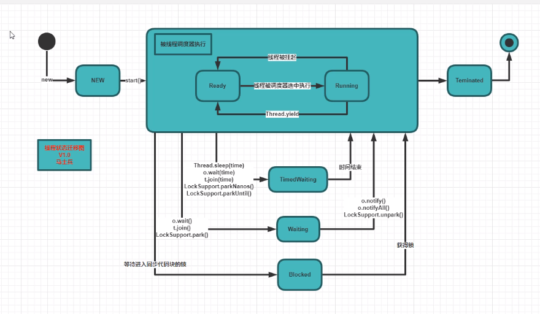

## Design Pattern(23种)

书籍：设计模式，可复用面向对象软件的基础。

重要模式：观察者，代理，

## 创建类型

这些设计模式提供了一种在创建对象的同时隐藏创建逻辑的方式，而不是使用 new 运算符直接实例化对象。这使得程序在判断针对某个给定实例需要创建哪些对象时更加灵活。

#### 工厂模式

1. 静态工厂(简单工厂)

   1. 定义：提供一个工厂类，可以根据参数完成对象的创建。

   2. 优点：

      1）实现了封装和部分解耦：客户端不用关注对象以及对象创建的过程。

      2）实现复用：创建对象不需要单独实例化，而是通过工厂类直接获取实例。

      3）实现多态：通过传入不同的参数来实现多态，达到实例化不同对象的目的。

   3. 缺点：

      1）违反开闭原则：实例化对象的逻辑都在一个类中，需求变化时，需要修改工厂类。

      2）不方便扩展子类。

2. 工厂方法

   1. 定义：定义一个用于创建对象的接口，让子类决定实例化哪个类。

   2. 优点：

      1）在简单工厂的基础上遵循了开闭原则，又进行了解耦，工厂类分为具体的工厂类，将实例化某一类对象具体细分给对应的工厂。

      2）扩展性好（若有新产品，则只需要新加工厂类）。屏蔽了产品类（产品类变化，与调用者无关）。

      3）遵循迪米特，里氏替换，依赖倒置原则。

   3. 扩展：

      1）替代单例模式：使用反射生成实例。

      2）延迟初始化：一个对象被消耗完毕，并不释放，工厂类保持其初始状态，等待再次使用。缓存。

3. 抽象工厂

   1. 定义：为创建一组相关或者是相互依赖的对象提供一个接口，而不需要指定它们的具体类。

   2. 实现：是对工厂模式又进行了一层抽象，不单单是像工厂模式只生成一类产品，而是一系列产品，并且可以像零件一样灵活配置给各工厂。(产品族：两个相互影响的产品线。)

      ​           将工厂模式的主体类的抽象工厂方法提为一个接口，用对象合成取代了类继承。更高灵活度, 复杂度。

   3. 应用：一组对象有相同的约束条件。如不同系统下的文本和图片编辑器，共同的约束条件是：操作系统类型。
      
   4. 优点：
   
   1) 封装性，分离了具体的类
      Abstract Factory 模式帮助你控制一个应用创建的对象的类。因为一个工厂封装创建产品对象的责任和过程，它将客户与类的实现分离。客户通过它们的抽象接口操纵实例。产品的类名也在具体工厂的实现中被分离；它们不出现在客户代码中。

      2) 使得易于交换产品系列
      一个具体工厂类在一个应用中仅出现一次—即在它初始化的时候。这使得改变一个应用的具体工厂变得很容易。它只需改变具体的工厂即可使用不同的产品配置，这是因为一个抽象工厂创建了一个完整的产品系列，所以整个产品系列会立刻改变。

      3) 产品族内的约束为非公开状态，有利于产品的一致性
      当一个系列中的产品对象被设计成一起工作时，一个应用一次只能使用同一个系列中的对象，这一点很重要。而AbstractFactory很容易实现这一点。

   5. 缺点：
   
   1) 难以支持新种类的产品，产品族的扩展困难。
      难以扩展抽象工厂以生产新种类的产品，这是因为AbstractFactory接口确定了可以被创建的产品集合。 支持新种类的产品就需要扩展该工厂接口，这将涉及 AbstractFactory类及其所有子类的改变。

4. 保变原则：保护的变化是产品的来源。

#### 建造者模式

定义：将一个复杂对象的构建与它的表示分离，使得同样的构建过程可以创建不同的表示。

解析：
1. 分离复杂对象的构建和表示。
2. 同样的构建过程可以创建不同的表示。

优点：封装性，建造者独立，容易扩展，而且建造过程可以逐渐细化，而不影响使用。

场景：

1. 相同的方法，不同的执行顺序，产生不同的结果。
2. 产品类很复杂，或者产品类中调用顺序不同产生不同的

注意事项：建造者模式关注零件类型和装配顺序。而工厂模式关注零件的创建。

保变原则：被保护的变化是产品的制作细节。

用法包括：内部构建和外部构建。

#### 单例模式

定义：确保某个类只有一个实例，而且自行实例化，并向整个系统提供这个实例。
这个类提供了一种访问其唯一的对象的方式，可以直接访问，不需要实例化该类的对象。

单例模式解决的问题
保证一个类仅有一个实例，并提供一个访问它的全局访问点。防止一个全局使用的类频繁地创建与销毁，节省资源，方便管理。

单例模式注意事项
单例类只能有一个实例。单例类必须自己创建自己的唯一实例，其他任何地方无法通过构造方法创建对象，也意味着需要构造方法私有化。单例类必须给所有其他对象提供这一实例。

高并发情况下，注意线程同步问题。

使用场景
共享访问点或共享数据，如网站的计数器，一般也是采用单例模式实现，否则难以同步。
要求生成唯一序列号的环境。
大量定义静态常量和静态方法的环境。如工具类。
创建对象需要消耗资源过多，如访问IO，数据库资源等。（文件系统，数据库连接池）

代码实现：
1. 单例模式又分为懒汉模式和饿汉模式，（双重校验锁，枚举和静态内部类。）
2. 两种的区别在于是不是启动的时候创建对象：
       饿汉模式不管是否需要对象，都先创建好。
       懒汉模式是在需要对象的时候，进行对象的创建。
3. 本质区别是时间和空间的取舍：
       懒汉模式是用时间换空间，启动时候不需要创建对象，节省了空间，但是访问对象的时候要判断是否已经创建对象，会浪费一些时间。
       饿汉模式是用空间换时间，启动的时候创建对象，浪费了一些空间，但是访问的时候，不需要创建对象和判断对象是否存在，节省了时间，提高了效率。
4. 懒汉模式存在一些问题
       在多线程的情况下，多个线程同时调用getInstance方法，可能会创建多个对象，违背了单例模式只有一个实例的原则，需要对getInstance进行同步处理。同步处理后，保证只会创建一个单例，但是效率很低，是对整个getInstance方法加锁，一旦对象已经创建，每次只能有一个线程访问对象，可以通过双检锁的方式进行优化，既可以保证只会创建一个对象，同时又允许多个线程访问实例。

优缺点
优点：可以节省内存开销，减少系统的性能的开销，避免对资源的多重占用，在系统设置全局访问点，优化和共享资源访问。
缺点：不适用于变化的对象，如果同一类型的对象总是要在不同的用例场景发生变化，单例就会引起数据的错误，不能保存彼此的状态。由于单利模式中没有抽象层，因此单例类的扩展有很大的困难。 单例类的职责过重，在一定程度上违背了“单一职责原则”

扩展：一个类只能产生固定个数的实例，即为有上限的多例模式。
作用是修正单例模式可能存在的性能问题，提高系统响应速度。如文件读取，可以初始化多个Reader实例，则在读取文件时，可快速响应。

#### 原型模式

定义：用原型实例指定创建对象的种类，并通过拷贝这些原型创建新的对象。

优点：

1. 性能优良，是内存二进制流的拷贝
2. 逃避构造函数的约束，构造函数不会执行。

实现：编程语言自带。

1. JAVA需要实现标记型接口Cloneable, 是一个空接口，相当于一个标志，没有实现该接口的类是无法调用clone()方法的。这里的标志判断是在native方法中进行。
2. 重写clone()方法，设为public。克隆对象的clone()方法并不属于Cloneable接口，它是Object类的一个方法. 
3. 没有重写Object的clone()方法且没有实现Cloneable接口的实例上调用clone方法，会报`CloneNotSupportedException`异常
4. .NET实现接口ICloneable，并重写clone方法。

使用场景：一个对象，多个修改者，对象的部分属性已确定，需要大量对象时，可以节省指定属性的代码语句。

与final关键字冲突。

浅克隆和深克隆：

- 对于非基本类型的变量（如自定义的类），浅复制保存的仅仅是对象的引用，导致clone后的非基本类型变量和原始对象中相应的变量指向的是同一个对象，对非基本类型的变量的操作会相互影响。
- 深克隆在clone()方法中除了要克隆自身对象，还要对其非基本数据类型的成员变量克隆一遍
- String类型不需要进行深克隆(即使使用new)：String存储在常量池中，修改克隆的对象的String类型，只会更改String类型的引用，使它指向常量池中新的字符串，不影响原型的数据。但如果使用StringBuilder时，需要深克隆。

深克隆的方式有两种：

1. 使用Cloneable接口
   第一步，克隆的类要实现Cloneable接口和重写Object的clone()方法；
   第二步，先调用super.clone()方法克隆出一个新对象，然后手动给克隆出来的对象的非基本数据类型的成员变量赋值。
2. 使用序列化
   克隆对象实现Serializable接口。先对对象进行序列化，紧接着马上反序列化。需要注意克隆对象的非基本数据类型成员也需要实现Serializable接口，否则会报错，成员无法被序列化。

## 结构类型
#### 桥梁模式

定义：将抽象部分和实现部分分离，使它们可以独立的变化。
		   信息隐藏只能将接口与实现从逻辑上分离，而桥梁模式能从物理上分离，使一个类同时拥有多种实现，并可以动态切换。

实现：分离抽象和具体，用聚合的方式连接抽象和具体。实现双维度扩展。
           两个类型层级形成的聚合层级。使用了类间的聚合关系、继承、覆写

涉及：抽象，分解，层级的方式，以及两大原则：间接原则，保变原则

优点：

1. 抽象和实现分离：实现不受抽象约束，不用再绑定在一个固定的抽象层次上。
2. 可扩展性好：抽象和实现都可以随意增加，
3. 实现细节对客户透明：抽象层通过聚合完成封装。

使用场景：

1. 不适用继承的场景
2. 接口或抽象类不稳定。
3. 重用要求高。设计的颗粒度越细，重用的可能性越大。

解决的问题：
1.类继承的缺点(继承有N层) ，重写，扩展不易。
2.抽象父类包含两个变化点，导致相互组合后，子类过多，类爆炸。
   如女士皮包有很多种，可以按用途分、按皮质分、按品牌分、按颜色分、按大小分等，存在多个维度的变化，所以采用桥接模式来实现女士皮包的选购。
   颜色类（Color）是一个维度，定义为实现化角色，它有两个具体实现化角色：黄色和红色，通过 getColor() 方法可以选择颜色；
   包类（Bag）是另一个维度，定义为抽象化角色，它有两个扩展抽象化角色：挎包和钱包，它包含了颜色类对象，通过 getName() 方法可以选择相关颜色的挎包和钱包。

最佳案例：
	Father类有一个方法A，Son继承了这个方法，然后GrandSon也继承了这个方法，问题是突然有一天Son要重写父类的这个方法，修改的风险就太大！因为GrandSon要用从Father继承过来的方法A，如果你修改了，那就要修改Son和GrandSon之间的关系。
	桥梁模式描述了类间弱关联关系，Father类完全可以把可能会变化的方法放出去，Son子类要拥有这个方法很简单，桥梁搭过去，获得这个方法，GrandSon也一样，即使你Son子类不像使用这个方法也没关系，对GrandSon不产生影响，他不是从Son中继承来的方法。

#### 适配器模式

定义：接口转换器，解决服务提供者和使用者之间接口不兼容的问题。

特点：改变对象的接口(只做接口转换)，保持对象的职责

实现方式：在适配器对象内部，调用源对象的功能，向往提供新的接口。将原有的继承关系改为关联关系。

优点：

1. 让两个没有任何关系的类一起运行。
2. 提高类的复用性，以及灵活性。

遵循：迪米特法则，保变原则，开闭原则。

区别：桥梁模式重点是分解，让接口和实现分离，可维护性。
			适配器模式重点是结合，让无关的类结合共事，可重用性。

场景：修改已投产的接口 ，或者进行系统的扩展。

例子：InputStreamReader，DataAdapter(用作DataSet和数据源之间的适配器，filll，update，数据源来自不同数据库)

#### 代理模式

定义：对其它对象提供一种代理，用来控制对这个对象的访问。

特点：保持对象的接口，限制接口的服务

优点：

1. 职责清晰（具体主题不用关心非本职的事务，代理类可以扩展其它功能），
2. 高扩展性(具体主题的变化，不会影响代理类）。

类别：虚拟代理，远程代理，缓存代理，智能引用，保护代理。

实现：

1. 普通代理(给代理对象指定真实对象,不允许直接创建真实角色)，
2. 强制代理(真实对象指定代理对象,不允许直接访问真实角色)，
3. 动态代理(反射动态生成，被代理类必须实现一个接口；实现横切面编程，在不改变代码的前提下，增强或控制对象的行为).

Java实现动态代理: 

- asm在运行时,动态生成二进制.  (时序图)
- Instrument 拦截class加载方法,处理二进制. 
- CGLIB. 被代理类无法用final修饰.  底层asm. 被代理类不需要接口。

#### 装饰器模式

定义：动态的给一个对象添加一些额外的职责。

目的：动态增减功能，减少子类膨胀。

方式：

1. 装饰器与被装饰者有聚合关系和继承关系，聚合是因为包含，继承是保证被装饰者的透明性，客户代码不会应为一个组件是否被装饰而有所不同。
2. 类型层级和聚合层级交合，类型层级在编译期决定，聚合层级是动态生成。
3. 继承改为合成。静态改为动态。
4. 1对1关系

特点：改变对象的职责，保持对象的接口，增强接口的服务，比生成子类更灵活。

优点：

1. 装饰类和被装饰类独立发展，去耦合。把类的核心职责和装饰功能分离，去除相关类中重复的装饰逻辑。
2. 替代继承关系，可动态扩展一个实现类的功能。
3. 如三个继承关系father, son ,grandson3个类，若想在son类上增加功能，需要考虑是修改son的方法，或者是增加方法，会对grandson有什么影响，grandson越多，工作量越大。而装饰器模式相当于创建一个新类，不对原有程序进行修改。

缺点：多层装饰过于复杂。需要尽量减少修饰类的数量，降低系统的复杂度。

NET：BufferedStream，CryptoStream等式具体装饰类，为FileStream，MemoryStream动态增加功能，省略了抽象装饰角色。

应用场景：扩展一个在继承关系中的类的功能，可动态增加或撤销。或者为一批兄弟类进行改装或加装功能。

#### 组合模式

定义：将对象组合成树形结构以表示“部分-整体‘的层次结构，使用户对单个对象和组合对象的使用具有一致性。

目的：为了抽象理解和统一管理数量众多，类型不同的树形结构。

方式：化不同为相同，化多个为一个。1对多关系。

区别：与装饰器模式一样，都是使用类型层级和聚合层级来构造更大的复合结构。
			装饰器模式是退化的复合模式。目的不相同。

优点：

1. 高层模块调用简单，单个对象和组合结构有统一的接口。
2. 节点自由增加。

缺点：场景类中，叶子节点和树枝使用了实现类。与依赖倒置冲突，限制了接口的影响范围。

特点：

1. 开放式的递归合成
2. 树形层级结构，分为透明型(并集)和安全型(交集)
3. 不同类型的组件，建立物理关系(聚合层级), 并建立逻辑关系(类型层级),保证操作接口的一致性，如布局管理器的抽象。

使用场景：

1. AWT采用安全型复合：Component类的子类Container类相当于Composite,具有管理子类的接口，Button，Label类相当于Leaf。
2. Swing采用透明型复合：JComponent类相当于Component，它是Container类的子类，所以所有Swing组件都有管理子组件的功能，JPanel，Box相当于Composit，JButton，JLabel为Leaf。
3. 树形菜单，文件和文件夹的管理。
4. 从一个场景中能独立出部分模块或功能的场景。

注意事项；只要是要体现局部和整体的关系时，而且关系可能比较深，使用组合模式。

#### 外观模式(门面)

定义：定义一个高层接口，为子系统中的一组接口提供一个一致的界面，更容易使用。

特点：

1. 封装多个对象，并改变被包装对象的接口。（装饰器和代理只能包装一个对象）
2. 提供层更高的抽象和粒度更粗的服务，统一和简化外界对子系统的访问。

优点：

1. 减少系统的相互依赖
2. 提高灵活性和安全性。

缺点：不符合开闭原则。

实现：

1. 三层结构的层与层之间建立外观Facade,降低耦合
2. 子系统因为不断的重构变得越来越复杂，产生很多类，增加外观Facade提供一个简单的接口，减少依赖。
3. 使用外观Facade封装遗留的系统或代码，为新系统提供清晰，简单的接口。
4. 对外或对内。

遵循：迪米特法则，保变原则。

注意事项：一个子系统可以有多个门面，门面不参与子系统内的业务逻辑。

#### 享元模式

定义：运用共享技术有效的支持大量细粒度的对象。（细粒度对象，则不可避免的使得对象数量多且性质相近）

对象信息：内部状态（可共享的信息，与环境无关），外部状态（随环境改变而改变，不可共享）。

优点：针对软件的运行质量，对于值语义对象，通过共享机制，减少对象的创建，降低内存占用，增强程序的性能。

缺点：逻辑复杂，处理中需要区分对象的内部状态和外部状态。

关键：抽象出一类对象的内在的，不因环境而异的状态，封装后作为共享单元。

实现：具体享元实现抽象享元的公共接口，非享元的外部状态以参数的形式通过方法传入。

注意事项：多线程下的线程安全。外部状态类最好是基本类型，否则自定义类需要覆写equals和hashcode方法，效率还低。

例子：String。池化技术(线程池。连接池)

## 行为类型
#### 责任链模式

定义：使多个对象都有机会处理请求，从而避免请求的发送者和接收者之间的耦合关系。将多个对象连成一条链，沿着这条链传递该请求，直到有一个对象处理它为止。

优点;  将请求和处理分开,两者解耦,提高系统灵活性.（请求和处理都包含状态属性，通过状态，让符合条件的处理来接收请求）。

缺点：链比较长时, 性能问题, 可控性差，职责多级传递，不知道何处出错。

应用：

1. 事件模型中，如DOM中，从外到内的事件捕捉，从内到外的事件冒泡。
2. 框架，容器中，如Java Servlet的Filter机制。
3. 异常处理机制：需要分模块分时间分批次完成，不同抽象层次的对象处理不同层次的异常，通过包装提升异常的抽象层次，交予上级处理。

方法捕捉异常的处理情形：

1. 不在方法规范的职责内，将异常和必要信息以更抽象的形式包装，抛给更高层。
2. 部分由该方法负责，处理并抛出。
3. 完全由该方法负责，处理异常，不抛出。

涉及：单一职责原则，间接原则，保变原则，迪米特法则。

综合应用：责任链关注职责的分解，侧重行为，装饰者关心职责的结合，侧重结构。责任链的每一环为某个对象进行装饰和包装。

#### 迭代器模式

定义：提供一种方法顺序访问一个聚合对象中各个元素，而又不暴露该对象的内部表示。

问题：数据结构分为：物理结构(数组-连续存储，链表-无序存储)和逻辑结构(二叉树，集合，队列，栈，B-tree)。每个结构的遍历方式都不一致，无法实现通用的代码。

方案：迭代器模式为遍历不同的聚集性结构，提供统一的遍历方式和接口。每种数据结构实现各自的迭代器，通过统一的接口来实现遍历，实现代码重用。

例子：数组和链表的实现（插入，删除，随机访问，扩展）

#### 访问者模式

定义：表示一个作用于某对象结构中的各元素的操作。在一个对象的数据结构固定的情况下，抽象出对于内部元素的操作，可以在不改变类的前提下，定义作用于这些元素的新操作。

优点：

1. 符合单一职责原则，
2. 扩展性，灵活性高。

缺点：

1. 具体元素对访问者公布细节。
2. 内部具体元素变更困难。需要修改对多个访问者对象。
3. 违背了依赖倒置原则。访问者依赖具体元素，而不是抽象元素。

目的：克服OOP语言的单分派的局限而设计的。

1. 分派：是为一个调用点call site确定相应调用方法的过程。通常根据方法名，参数类型和个数决定。

2. 静态分派：分派能在编译期决定。如重载多态和参数多态。（静态绑定）

3. 动态分派：分派能在运行期决定。如子类型多态（在运行期间，根据一个方法的接收者--即方法所属的对象--的实际类型，来决定该调用那种方法。如重载（动态绑定）

4. 单分派：分派仅取决于一个类型，即方法的接受对象的类型。

5. 为什么方法重载依据是方法参数，方法覆盖依据的是实例类型?

   1. 表面上，方法重载发生在同一个类中，只能靠方法签名来区分。方法覆盖发生在不同的类型，签名是一样的，只能靠实例类型区分。
   2. 实际上，从编译器角度看，在进行方法分派时，是同时考察方法的参数类型和实例类型的。区别是，前者的考察在编译期结束，后者的考察要延续到运行期。
   3. 迟绑定：有性能损耗，但带来多态机制。
   4. 新的问题：为什么在运行期单单考察实例类型而不考察参数类型？
      1. 实例也是方法的一个参数，但在一般的OOP语言中被提到方法名的前面。
      2. 理论上，这种分派方式不合理的。

6. 对象之间的合作，如两个集合进行交集运算：

   1. 纯过程式：对象彼此是平等的，共享intersect方法运行期由两个对象的实际类型共同决定。

      intersect(set1,set2);

   2. OOP：有且仅有一个对象时方法的拥有者或消息的接收者。

      set1.intersect(set2);

7. 多分派：分派取决于两个参数的类型。

应用场景：

1. 在需要对一个对象结构中的对象进行很多不同而且不相关的操作时。
2. 是迭代器模式的扩充，可遍历不同的对象，执行不同的操作。可以充当拦截器。
3. 语言编译器。将表达式解析为抽象语法树（AST Abstract Syntax Tree)。常用操作：类型检查和生成中间代码。AST的每个节点需要各种操作，放在各个节点内会不利于扩展，需要使用访问模式，将对每个节点的处理单独抽象出来，生成如typecheckVisitor, generationCodeVisitor的访问者。、

##### ASM

官网学习文档：http://asm.ow2.io

含义：C语言中，可以使用\_asm\_关键字，来写汇编语言。它允许使用AsSeMbly汇编语言实现一些方法。

应用：

1. 新增访问者模式，修改类的二进制，方法中增加处理操作。
2. 直接写二进制文件。
3. 生成动态代理的类。

学习Java中编译为二进制的class文件结构：书籍Java 虚拟机规范和Oracle网站的文档。

查看二进制插件：bytecode viewer

#### 命令模式

别名：Action / Transaction

定义：将一个请求或命令封装为一个对象，从而可使用不同的请求对客户进行参数化；对于请求排队，记录请求日志，支持可撤销操作。

优点：类间解耦（调用者和接收者无依赖），可扩展性（命令子类容易扩展，也容易膨胀）                                                                                                                                                                                                                                                                                                                                                                                                                            

应用：

1. 宏命令：结合组合模式实现（是树状结构)
2. 多次撤销undo：结合责任链模式，实现文本编辑器。
3. transaction事务回滚：结合备忘录模式实现。

#### 观察者模式

Observer，Listener，Hook钩子函数，Callback回调函数，Publish/subscribe发布订阅。

定义：定义对象间一种一对多的依赖关系，使得每当一个对象改变状态，则所有依赖于它的对象都会得到通知并自动更新。

优点：

1. 用于维护一组相关对象的一致性。
2. 观察者和被观察者之间是抽象耦合。
3. 建立一套触发机制。

缺点：

1. 广播链的问题：逻辑复杂，可维护性差。
2. 异步处理问题：多级触发的效率低，而且消息的通知一般是顺序执行，有一个观察者卡壳，则会影响整体的效率。

使用场景：

1. 事件多级触发。事件委托
2. 跨系统消息交换。如消息队列的处理机制。
3. 可拆分的关联行为场景。
4. 通常与责任链模式结合，负责对事件的处理，其中某一个observer负责是否将事件进一步传递。

Java提供java.util.Observer接口和Observable

#### 中介者模式

定义：用一个中介对象来封装一系列的对象交互。使各个对象不需要显示的互相引用，使其松耦合，并可以独立的改变它们之间的交互。

优点：减少类间的依赖，降低耦合，将一对多的依赖变为一对一。

缺点：交互集中化，使中介者的逻辑复杂。

使用场景：

1. 应用于一组对象以定义良好但是复杂的方式进行通信的场合，如Form窗体对象或Web页面。
2. 多个对象紧密耦合，如蜘蛛网状结构，可用中介者模式将其梳理为星状结构。

实际应用：

1. 机场调度中心：
2. MVC框架：controller就是中介者。把视图和业务逻辑隔离开，提升产品性能和扩展性。
3. 媒体网关：MSN的用户，都将消息发送给MSN服务器。而像飞鸽，没有中介者，使用UDP广播，则客户端也是服务端。
4. 中介服务：租房中介。

中介者模式很少用到抽象类或接口，与依赖倒置冲突其原因是：
答：中介者管理的是同事类，而非兄弟类，是协作关系，不能在接口或抽象类中定义同事类必须具有的方法（看出继承的高侵入性）。对象没有共性，就不能使用抽象。

#### 备忘录模式

定义：在不破坏封装性的前提下，在外部记录一个对象的内部状态，便于将对象恢复到原来保存的状态（回滚）。

优点：实现对象的恢复，并使内部信息对其它对象隐藏，保持封装的边界。

应用：

1. 保存和恢复数据的场景，如事务管理的回滚。
2. 记录快照（瞬时状态），维护类属性的历史。
3. 存盘：对象实现序列化，直接存储在硬盘。游戏Tank的存档。

注意事项：管理备忘录的生命周期，性能（不要在频繁建立备份的场景下使用）

扩展：

1. clone方式的备忘录，
2. 多状态的备忘录。反射。
3. 多备份的备忘录。集合存储。
4. 备份的数据不能修改。内置类。

#### 模板模式

定义：在一个方法中定义一个算法的骨架，而将一些步骤延迟到子类中。使得子类可以在不改变算法结构的情况下，重新定义算法中的某些步骤。

方法类别：

1. 抽象方法：由抽象类声明，由具体子类实现，并以abstract关键字进行标识。
2. 具体方法：由抽象类声明并且实现，子类并不实现或者做覆盖操作。
3. 钩子方法：由抽象类声明并且实现，子类也可以选择加以扩展。
4. 模板方法：定义了一个方法，包含钩子方法，定义了整个逻辑的基本骨架。

优点：

1. 封装不可变，扩展可变部分。
2. 提取公共部分代码，代码复用，便于维护。
3. 行为由父类控制，子类实现。

缺点：通常设计中，所有的具体实现都由子类完成。但在模板模式中，父类分担了子类的责任，使得父类可以调用子类的方法，而子类会对父类产生影响。复杂项目中，增加阅读难度。

使用场景：

1. 重要，复杂的算法，可以把核心算法设计为模板方法。其它细节功能由子类实现。
2. 重构时，提取公共代码到父类中，通过钩子函数约束其行为。

#### 状态模式

定义：当一个对象的内在状态改变时，允许改变其行为。也就是对象的行为取决于它的状态。

优点：

1. 结构清晰，解决一个对象状态转换的条件表达式很复杂的情况。
2. 封装：把状态的判断逻辑转移到表示不同状态的一系列类当中，把复杂的判断逻辑简化。
3. 遵循开闭原则和单一职责原则。

缺点：子类膨胀，使用数据库的状态表存储状态。

注意事项：行为受状态约束的情况下，使用状态模式，对象的状态最好不超过5个。

应用：线程的有效状态机FSM，实现状态的迁移（迁移可以是有顺序，也可以无序且多个）。

#### 策略模式

定义：封装一组算法，让它们可以相互替换。使算法的变化，不会影响到使用者。

优点：

1. 算法可自由切换。
2. 扩展性好，避免多重条件判断。

缺点：

1. 策略类的数量多，复用可能性小。
2. 所有策略类需要对外暴露。一般使用工厂方法，代理或享元来修正。

注意事项：若策略数量超过4个，考虑使用混合模式，来解决策略类膨胀和对外暴露的问题。

使用场景：

1. 多个类只有在算法上稍有不同的场景。
2. 算法需要自由切换。
3. 需要屏蔽算法规则。

应用：排序(Comparator)，实现Tank开火策略。

扩展：策略枚举，真实的面向对象，但受枚举类型限制，扩展性不好。

#### 解释器模式

定义：给定一门语言，定义它的文法表示和一个解释器，该解释器使用该表示来解析语言中的句子。

优点：是一个简单的语法分析工具，扩展性好。

缺点：类膨胀。使用递归和循环访问，效率低。复杂不易维护。

应用：对于发生频率搞定的问题，可以将该问题的各个实例表述为一个简单语言的句子，并通过构建的解释器，去解释这些语句来解决该问题。如：动态脚本解析。

注意事项：不要再重要模块中使用解释器。可使用脚本语言来代替，如JRuby

#### 指导思想 

1. 可维护性Maintainability：修改功能，改动的地方越少越好。
2. 可复用性Reusability：代码复用和公共类库。
3. 可扩展性Extensibility/Scalability：添加功能无需修改原有代码。
4. 灵活性flexibility/mobility/adaptability：代码接口灵活调用。

熟记设计模式；典型用法和类图。

参考：https://github.com/kkzhilu/Kerwin-DesignPattern
