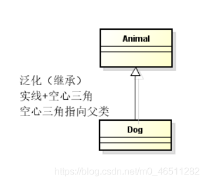
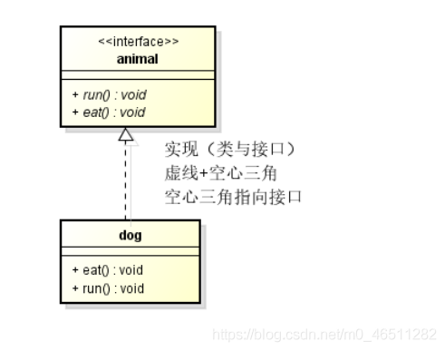
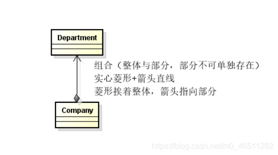
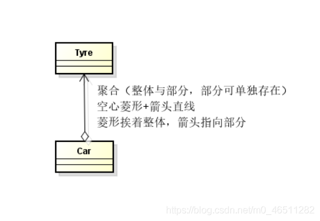
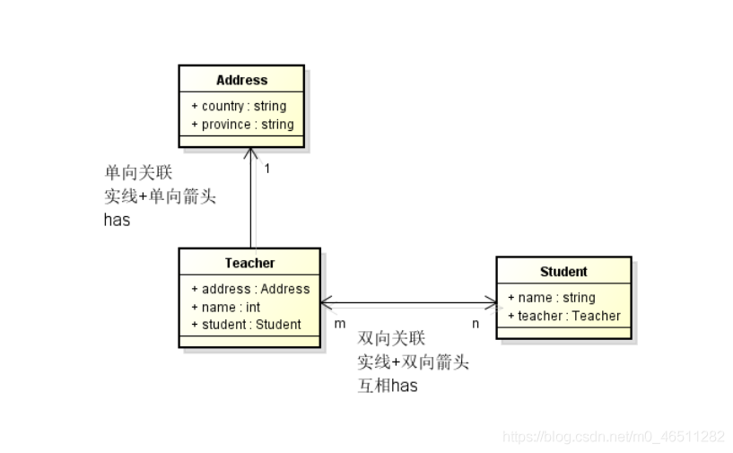

### UML

1. 定义：Unified Modeling Language 统一建模语言。
2. 九种建模图：用例图,类图,对象图,顺序图,协作图,状态图,活动图,组件图,配置图

##### 类图

1. 类间关系：

   1. 泛化(Generalization)

   2. 实现(Realization)

   3. 组合(Composition)：contains-a 基于值语义的包含

      定义：是关联关系的一种特例，他体现的是一种contains-a的关系，这种关系比聚合更强，也称为强聚合；他同样体现整体与部分间的关系，但此时整体与部分是不可分的，整体的生命周期结束也就意味着部分的生命周期结束；

      举例：比如你和你的大脑；公司和部门。

      表现在代码层面，和关联关系是一致的，只能从语义级别来区分；

      

   4. 聚合(Aggregation)：owns-a 基于引用语义的包含

      定义：是关联关系的一种特例，他体现的是整体与部分、拥有的关系，此时整体与部分之间是可分离的，他们可以具有各自的生命周期，部分可以属于多个整体对象，也可以为多个整体对象共享；

      举例：比如计算机与CPU、公司与员工的关系等；

      表现在代码层面：和关联关系是一致的，只能从语义级别来区分；

      

   5. 关联(Association)，has-a 偏于引用语义

      定义：体现的是两个类、或者类与接口之间语义级别的一种强依赖关系，可以是单向、双向的。

      举例：比如我和我的朋友；这种关系比依赖更强、不存在依赖关系的偶然性、关系也不是临时性的，一般是长期性的，而且双方的关系一般是平等的、

      表现在代码层面：为被关联类B以类属性的形式出现在关联类A中，也可能是关联类A引用了一个类型为被关联类B的全局变量；

      

      

   6. 依赖(Dependency)

      定义：是一个类A使用到了另一个类B，而这种使用关系是具有偶然性的、临时性的、非常弱的，但是B类的变化会影响到A；

      举例：比如某人要过河，需要借用一条船，此时人与船之间的关系就是依赖；

      表现在代码层面：类Computer作为参数被类Programmer在某个method方法中使用。

      

2.  按照关系的强弱顺序：泛化≥实现>组合>聚合>关联>依赖。

3. 依赖，组合，聚合，关联之间的区别

   

   组合：组合是关联中的一个特例，A类的成员变量是B类类型，非指针变量。则A类和B类是组合关系。

   聚合：聚合是关联中的一个特例，A类的成员变量是B类类型指针，则A类和B类是聚合关系。

   依赖和关联都是说一个类用到了另一个类。其区别在于一个是使用，一个是拥有。

   聚合与组合其实都是关联的特例，都是整体和部分的关系。他们的区别在于聚合的两个对象之间是可分离的，他们具有各自的生命周期。而组合往往表现为一种唇齿相依的关系。

### 设计工具

ProcessOn

Astah

