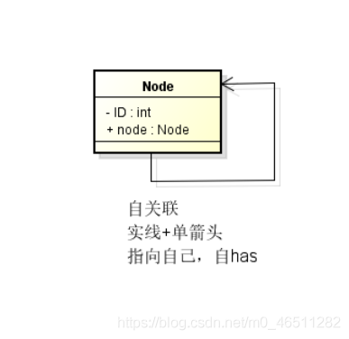
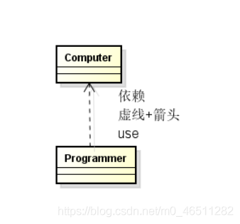

### UML

1. 定义：Unified Modeling Language 统一建模语言。

2. 九种建模图：用例图,类图,对象图,顺序图,协作图,状态图,活动图,组件图,配置图

3. 类图：

   1. 类间关系：

      1. 泛化(Generalization)
      2. 实现(Realization)
      3. 关联(Association)
      4. 聚合(Aggregation)
      5. 组合(Composition)
      6. 依赖(Dependency)

   2.  按照关系的强弱顺序：泛化≥实现>关联>聚合>组合>依赖。

   3. 依赖，组合，聚合，关联之间的区别

      依赖：A类的方法中，形参是B类的变量，或者B类指针或者B类的引用。则A类依赖于B类。

      关联：A类有成员变量是B类的类型，或者B类的指针类型。则A类关联于B类

      组合：组合是关联中的一个特例，A类的成员变量是B类类型，非指针变量。则A类和B类是组合关系。

      聚合：聚合是关联中的一个特例，A类的成员变量是B类类型指针，则A类和B类是聚合关系。

      依赖和关联都是说一个类用到了另一个类。其区别在于一个是使用，一个是拥有。

      聚合与组合其实都是关联的特例，都是整体和部分的关系。他们的区别在于聚合的两个对象之间是可分离的，他们具有各自的生命周期。而组合往往表现为一种唇齿相依的关系。

### 设计工具

ProcessOn

Astah

