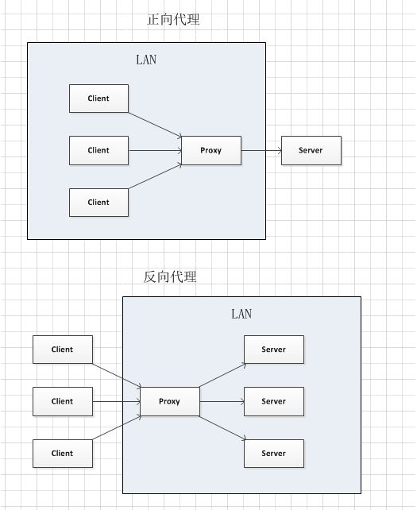

## 代理

代理其实就是一个中介，A和B本来可以直连，中间插入一个C，C就是中介

## 正向代理

正向代理类似一个跳板机，代理访问外部资源

比如我们国内访问谷歌，直接访问访问不到，我们可以通过一个正向代理服务器，请求发到代理服，代理服务器能够访问谷歌，这样由代理去谷歌取到返回数据，再返回给我们，这样我们就能访问谷歌了

**正向代理的用途：**

（1）访问原来无法访问的资源，如google

（2） 可以做缓存，加速访问资源

（3）对客户端访问授权，上网进行认证

（4）代理可以记录用户访问记录（上网行为管理），对外隐藏用户信息

## 反向代理

反向代理（Reverse Proxy）实际运行方式是指以代理服务器来接受internet上的连接请求，然后将请求转发给内部网络上的服务器，并将从服务器上得到的结果返回给internet上请求连接的客户端，此时代理服务器对外就表现为一个服务器

### 反向代理的作用：

（1）保证内网的安全，阻止web攻击，大型网站，通常将反向代理作为公网访问地址，Web服务器是内网

（2）负载均衡，通过反向代理服务器来优化网站的负载

## 总结

**正向代理即是客户端代理, 代理客户端, 服务端不知道实际发起请求的客户端.**

**反向代理即是服务端代理, 代理服务端, 客户端不知道实际提供服务的服务端**

### 看图理解一：

- - 

**

### 看图理解二：

正向代理中，proxy和client同属一个LAN，对server透明； 反向代理中，proxy和server同属一个LAN，对client透明。 实际上proxy在两种代理中做的事都是代为收发请求和响应，不过从结构上来看正好左右互换了下，所以把后出现的那种代理方式叫成了反向代理

### 总结：

正向代理: 买票的黄牛

反向代理: 租房的代理